<p align="center">
  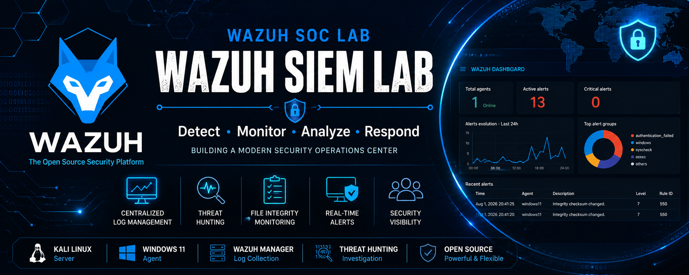
</p>
# 🛡️ Wazuh SOC Lab – Installation, Windows Agent Deployment & File Integrity Monitoring (FIM)

<p align="center">
  
  
  
  
</p>

---

## 📌 Project Overview

This project demonstrates the deployment of a complete **Wazuh Security Operations Center (SOC) Lab** using **Kali Linux** as the Wazuh server and **Windows 11** as the monitored endpoint.

The objective of this lab was to:

- Install Wazuh 4.12
- Configure the Wazuh Dashboard
- Deploy a Windows 11 Agent
- Configure File Integrity Monitoring (FIM)
- Generate security events
- Investigate alerts using Threat Hunting

---

# 🏗️ Lab Architecture

```
                    +------------------------+
                    |     Kali Linux VM      |
                    |------------------------|
                    | Wazuh Manager          |
                    | Wazuh Indexer          |
                    | Wazuh Dashboard        |
                    +-----------+------------+
                                |
                      Secure Agent Connection
                                |
                                |
                    +-----------v------------+
                    |     Windows 11 VM      |
                    |------------------------|
                    | Wazuh Agent            |
                    | File Integrity Monitor |
                    +------------------------+
```

---

# 🛠️ Technologies Used

- Wazuh 4.12
- Kali Linux
- Windows 11
- Filebeat
- Wazuh Dashboard
- Wazuh Manager
- Wazuh Indexer
- Oracle VirtualBox

---

# 📂 Repository Structure

```
wazuh-soc-lab/
│
├── README.md
├── screenshots/
│   ├── 01-prerequisites-installed.png
│   ├── 02-installer-downloaded.png
│   ├── 03-installer-permissions.png
│   ├── 04-installation-start.png
│   ├── 05-installation-complete.png
│   ├── 06-services-running.png
│   ├── 07-dashboard-login.png
│   ├── 08-agent-registration.png
│   ├── 09-windows-agent-connected.png
│   ├── 10-failed-login-alert.png
│   ├── 11-ossec-conf-custom-directory.png
│   ├── 12-fim-agent-running.png
│   ├── 13-threat-hunting-syscheck-dashboard.png
│   ├── 14-fim-events.png
│   └── 15-fim-alert-details.png
│
└── LICENSE
```

---

# 🚀 Installation

## 1. Install Required Packages

```bash
sudo apt install curl unzip wget apt-transport-https lsb-release gnupg -y
```

### Screenshot

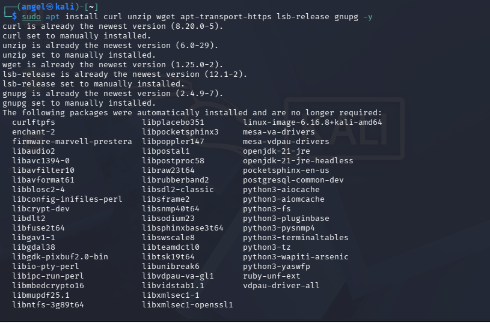

---

## 2. Download Wazuh Installation Script

```bash
curl -sO https://packages.wazuh.com/4.12/wazuh-install.sh
```

### Screenshot

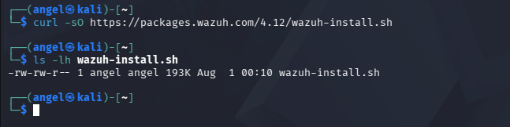

---

## 3. Make Script Executable

```bash
chmod +x wazuh-install.sh
```

### Screenshot

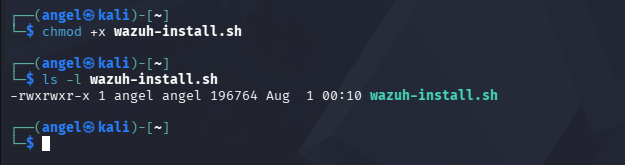

---

## 4. Install Wazuh

```bash
sudo ./wazuh-install.sh -a
```

### Screenshot

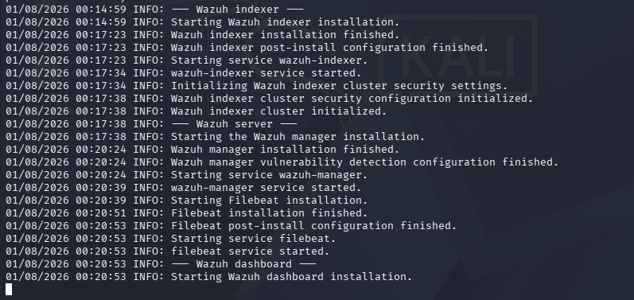

---

## 5. Installation Completed

The installer deploys:

- Wazuh Manager
- Wazuh Indexer
- Filebeat
- Wazuh Dashboard

### Screenshot

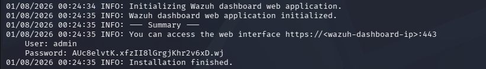

---

# ✅ Verify Services

```bash
sudo systemctl status wazuh-manager

sudo systemctl status wazuh-indexer

sudo systemctl status wazuh-dashboard
```

### Screenshot

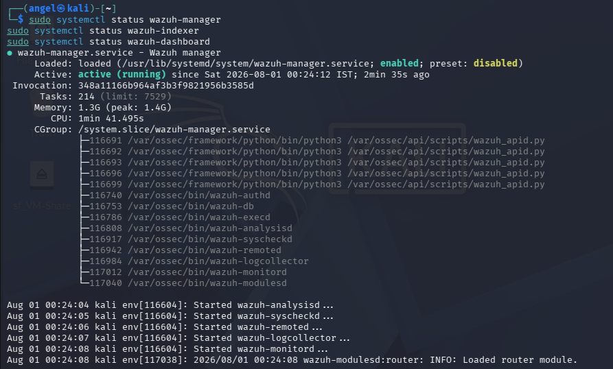

---

# 🌐 Wazuh Dashboard

Login using the credentials generated during installation.

### Screenshot

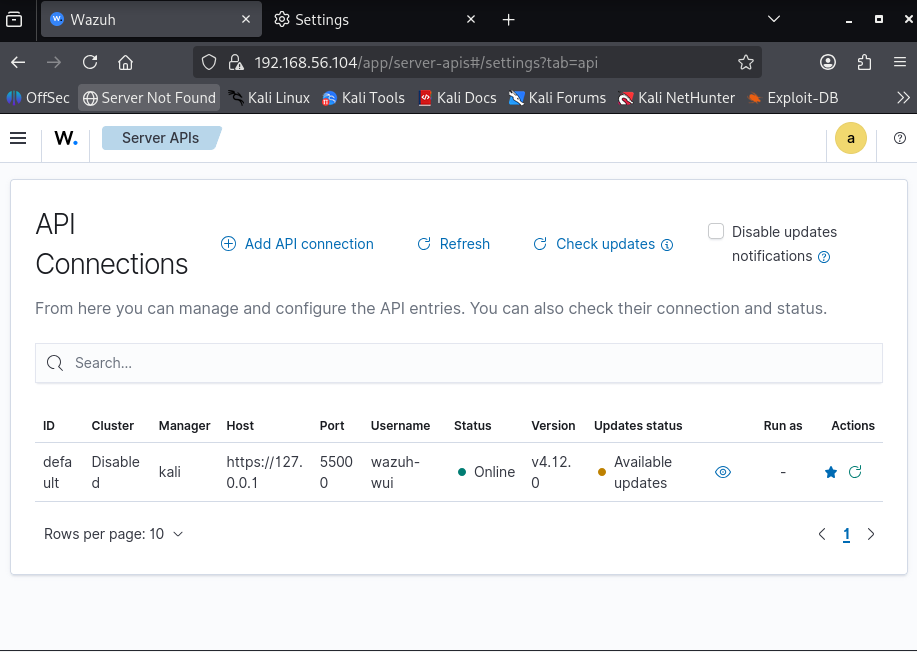

---

# 💻 Deploy Windows Agent

Deploy the Windows Agent from the Wazuh Dashboard.

### Screenshot

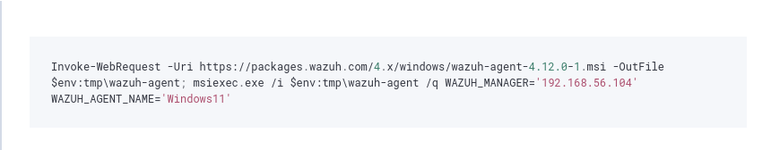

---

# ✅ Verify Agent Connection

After installation, verify that the Windows 11 endpoint appears online.

### Screenshot

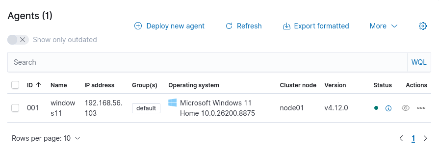

---

# 🔐 Authentication Monitoring

The Windows agent successfully forwards authentication events to Wazuh.

### Screenshot

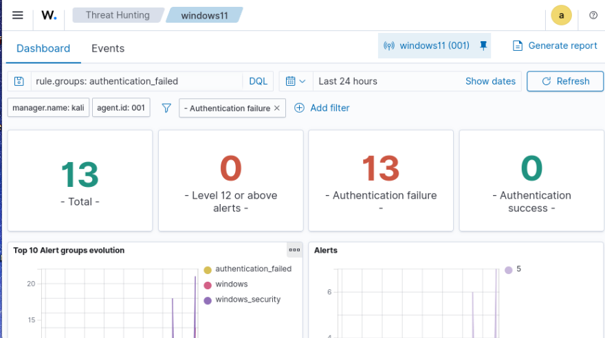

---

# 📁 Configure File Integrity Monitoring (FIM)

Edit:

```
C:\Program Files (x86)\ossec-agent\ossec.conf
```

Add:

```xml
<directories check_all="yes" realtime="yes">
C:\SOC-Lab
</directories>
```

Restart the Wazuh Agent.

### Screenshot

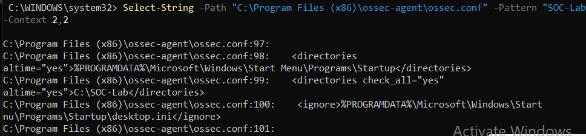

---

# ⚙️ Verify Real-Time Monitoring

The Wazuh agent starts Rootcheck and Syscheck in real time.

### Screenshot

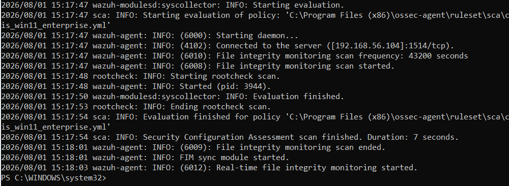

---

# 🔎 Threat Hunting

Navigate to:

```
Threat Hunting
```

Search:

```
syscheck
```

The dashboard displays File Integrity Monitoring alerts.

### Screenshot

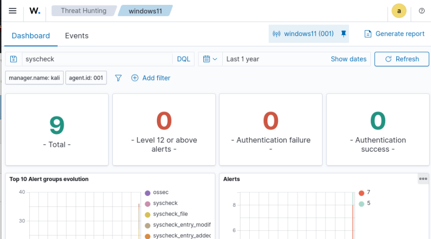

---

# 🚨 File Integrity Monitoring Alerts

Modify the monitored file:

```
C:\SOC-Lab\test.txt.txt
```

Wazuh immediately detects the change.

### Screenshot

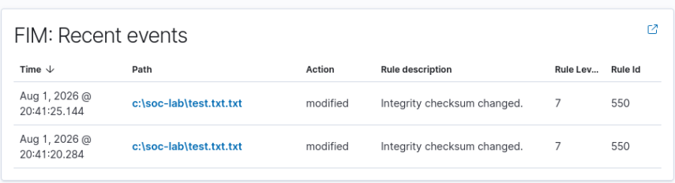

---

# 🔍 Alert Investigation

Inspect the generated alert.

The event contains:

- Agent Name
- Rule ID
- File Path
- Detection Mode
- Full Event Log
- File Modification Information

### Screenshot

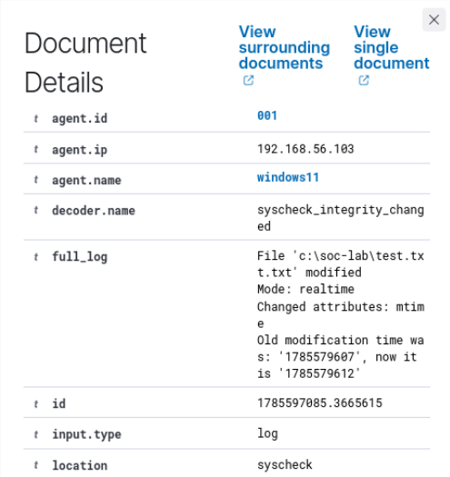

---

# 📈 Skills Demonstrated

- SIEM Deployment
- Wazuh Installation
- Endpoint Security
- Windows Agent Deployment
- Threat Hunting
- File Integrity Monitoring (FIM)
- Security Event Analysis
- Log Management
- Linux Administration
- Windows Administration

---

# 🎯 Learning Outcomes

Successfully deployed an enterprise-grade SIEM solution.

Configured Windows endpoint monitoring.

Implemented real-time File Integrity Monitoring.

Generated security events.

Investigated alerts using the Wazuh Threat Hunting module.

Validated end-to-end communication between the Wazuh Manager and Windows Agent.

---

# 📚 References

- Wazuh Documentation

https://documentation.wazuh.com

---

# 👨‍💻 Author

**Jaison Jerald**

Cybersecurity Enthusiast | CEH Certified | SOC Analyst Aspirant

GitHub:
https://github.com/jaisonjerald
